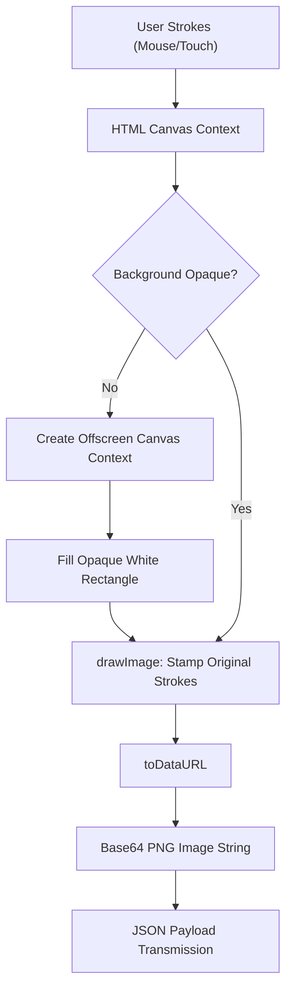
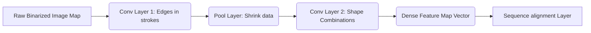

# Tenjin-Ya Handwriting Verification: AI and Image Processing Architecture

This document provides an exhaustive overview of the handwriting character recognition system integrated into the Tenjin-Ya Japanese Learning Application. It details the precise locations of the code, the functions involved, the algorithmic pipeline for image conversion and processing, and the deep learning algorithms powering the Optical Character Recognition (OCR) engine provided by Google Cloud Vision.

---

## 1. Architectural Overview and Code Locations

The handwriting recognition pipeline is a full-stack feature involving both the browser front-end (for capturing the user's strokes) and the Python FastAPI back-end (for processing the data, authenticating securely, and communicating with Google Cloud AI). 

### Backend Routes and Endpoints (`features/grammar/routes.py`)
The system consists fundamentally of two key components managed in the core routing configuration:

1. **The User Interface Endpoint**: `writing_exercise(system: str, count: int)`
   - This HTML route delivers the frontend canvas application. It takes dynamic query parameters that determine what character sets the user will practice (e.g., Hiragana, Katakana, or Kanji). It renders the `canvas` element, tracks stroke data, manages progression logic, and handles the JavaScript required to process the raw drawing data before transmission.

2. **The Verification Endpoint**: `verify_writing(submission: WritingSubmission)`
   - This POST endpoint receives a JSON payload containing the drawn image (encoded in Base64) alongside the expected Japanese character string. 
   - It performs the backend image decoding protocol.
   - It instantiates the Google Cloud Vision API client.
   - It parses the response to ascertain whether the expected Japanese character is present in the AI's detection results.

### Global Configuration (`main.py`)
To utilize AI safely, the Google Cloud Vision client must be instantiated with proper credentials. In `main.py`, the system maps the root-level configuration to a local service account key:
```python
cred_path = os.path.abspath(os.path.join(os.path.dirname(__file__), "google-credentials.json"))
if os.path.exists(cred_path):
    os.environ["GOOGLE_APPLICATION_CREDENTIALS"] = cred_path
```
By doing this dynamically, the deployment environment correctly inherits the IAM boundaries assigned specifically to the Cloud Vision service, preventing unauthorized use or leaks.

---

## 2. Frontend Image Conversion Pipeline

The conversion process begins natively inside the user's browser, utilizing the HTML5 `<canvas>` API.

### The Problem with Alpha Transparency
Originally, the system extracted the raw image data from the canvas using `putImageData()`, which grabbed an exact 1:1 copy of the pixel arrays. However, an inherent property of the HTML canvas is that its background is fundamentally **transparent** (alpha channel equals 0) by default, relying on CSS to visually render it as white or dark. 

When a user draws a black ink stroke on a transparent canvas, extracting the PNG sends an image with a black stroke on transparent pixels. When OCR APIs (like Google Vision) ingest images lacking background data, they notoriously default the transparent channel to black. Consequently, the AI would be reading a "black stroke on a pitch-black background," culminating in false negatives where "Nothing is detected."

### The `drawImage()` Solution
The solution implemented to resolve the transparency conflict involves a secondary, hidden image construction phase before submission:
1. A temporary off-screen canvas is created with the exact dimensions of the drawing.
2. The context of this temporary canvas is filled entirely with an opaque white rectangle (`fillStyle = "#FFFFFF"`).
3. Using the `drawImage()` API, the user's transparent-background drawing is forcefully "stamped" on top of the solid white rectangle.
4. The result is a strictly two-dimensional RGB image (black strokes layered directly atop white pixels) effectively eliminating alpha transparency issues.
5. Finally, the canvas data is rasterized into a spatial PNG and encoded into an ASCII Base64 string via the `toDataURL("image/png")` function.

### Visualizing the Data Flow



---

## 3. Base64 Encoding and Payload Transmission

Base64 is a binary-to-text encoding scheme. Due to HTTP JSON requests being text-based by design, transferring binary chunks (like a PNG image file) inherently risks malforming data streams.

The `toDataURL` method encodes the `8-bit` binary data of the image into a 64-character alphabet (`A-Z`, `a-z`, `0-9`, `+`, and `/`). 
The resulting transmission looks like this: `data:image/png;base64,iVBORw0KGgoAAAANSUhEUgAA...`

Once the payload reaches the FastAPI backend, the header (`data:image/png;base64,`) is stripped, leaving only the pure data signature. Python's `base64.b64decode()` algorithm converts this ASCII string back into the contiguous byte array representing the original PNG format. This byte array is exactly universally what Google Cloud Vision expects across its gRPC ingestion buffers.

---

## 4. Backend Processing and The Google Cloud Vision Interface

Within `features/grammar/routes.py`, the backend interacts with the raw byte data and communicates with the Google API:

```python
client = vision.ImageAnnotatorClient()
image = vision.Image(content=image_bytes)
image_context = vision.ImageContext(language_hints=["ja"])
response = client.document_text_detection(image=image, image_context=image_context)
```

The system aggressively hints to the API that the primary target language is Japanese (`"ja"`). This optimization step is vital. Japanese character sets encompass Hiragana (46 base characters), Katakana (46 base characters), and several thousand Kanji ideograms. By narrowing the AI's search space down from global unicode down to CJK (Chinese, Japanese, Korean) glyph probabilities, the inference speed is optimized, and false-positive alphabet detection (e.g., mistaking the Katakana `エ` for the Latin `I`) is heavily suppressed.

The application calls the `document_text_detection` method as opposed to standard `text_detection`. 
- **Text Detection:** Geared toward finding short spans of text "in the wild" (e.g., reading a stop sign).
- **Document Text Detection:** A specialized, high-density OCR model designed explicitly to preserve character layout, hierarchy (pages -> blocks -> paragraphs -> words -> symbols), and dense handwriting structures. Because Japanese learners might write characters closely stacked, Document Detection ensures stroke continuity analysis isn't fragmented arbitrarily.

---

## 5. The Algorithm Behind Optical Character Recognition (OCR)

Google Cloud Vision does not simply overlay the stroke onto an expected image and calculate a "difference." Instead, it runs the uploaded byte-stream through a massive pre-trained deep learning pipeline that combines **Convolutional Neural Networks (CNNs)** and **Recurrent Neural Networks (RNNs)**. 

### Stage A: Preprocessing and Binarization
Before the neural network evaluates the character, the Cloud Vision ingestion service heavily processes the uploaded byte structure. Although Tenjin-Ya's frontend already guarantees a white background, Google's algorithm forces severe contrast normalization. The algorithm detects local gradients and shadows and squashes the image mapping into a pure binary (1 or 0 / black or white) representation of active pixel topography. It then segments connected pixel clusters, drawing preliminary Bounding Boxes around suspected solitary glyphs.

### Stage B: Feature Extraction (The CNN Layer)
A Convolutional Neural Network analyzes the image array by sliding "filters" (small matrices evaluating pixel neighbors) across the image. 

1. **Lower Convolutional Layers:** These layers look for micro-features: vertical lines, slanted curves, and stroke intersections. For Japanese characters, differentiating strokes is crucial—for example, the subtle visual difference between Katakana `シ` (Shi) and `ツ` (Tsu) depends heavily on the initial stroke's gradient and alignment (horizontal vs vertical mapping). 
2. **Higher Convolutional Layers:** These map combinations of micro-features to identify macro-structures, such as a complete Kanji radical (e.g., the "water" radical `氵`). 

Because CNNs are spatially invariant, whether the user draws their character perfectly centered or slightly skewed in the top-right corner of the canvas, the CNN filter will trigger effectively upon encountering the feature shapes. 



### Stage C: Sequence Processing (The RNN/LSTM Layer)
While a CNN creates feature maps, reading hand-drawn characters—especially multiple characters written beside one another—requires sequential memory.

Google Cloud utilizes Bi-Directional Long Short-Term Memory (LSTM) networks. The network scans the feature map from left-to-right, and simultaneously right-to-left. 
- A Japanese character consists of structural flows. Though the vision API is interpreting a static image (and not capturing the live stroke-by-stroke timing data like WebGL ink trackers might), it attempts to slice the character into sequence points.
- Utilizing **Connectionist Temporal Classification (CTC)**, the algorithm can map an un-segmented line of pixels into a sequential unicode output without pre-determining exactly where character A ends and character B begins.

### Stage D: Probabilistic Softmax Classifier
The final output of the neural engine is a Softmax distribution—a probability curve identifying exactly what unicode character corresponds with the analyzed drawing.

For example, if the user draws Katakana `カ` (Ka), the final layer of the network contains neurons corresponding to tens of thousands of unicode codepoints. 
- Neuron [カ] might yield a 98.4% activation rate.
- Neuron [力] (the Kanji character for Power, which looks functionally identical to Ka) might yield a 94.2% activation rate.
- Neuron [オ] (O) might yield a 12% activation rate.

Because we pre-filtered the `vision.ImageContext` language map to heavily favor contextual Japanese outputs, it narrows the error margin significantly. The highest probabilistic match is decoded mapping back into a UTF-8 Japanese character. 

---

## 6. Integration and Response Arbitration 

Once the Google Cloud Vision model finalizes its Softmax probability prediction, it traverses back up the pipeline and responds over HTTP/2 gRPC to the FastAPI backend with the generated String payload in JSON. 

Because OCR models are often "over-eager," meaning they attempt to transcribe literal shapes exactly as drawn, a user might accidentally draw trailing ink spots, or the model might misinterpret a heavy border outline as an extra letter (for instance, reading a single `カ` as `カI` due to a trailing dot).

Our FastAPI implementation dynamically parses the raw return data logically rather than seeking a rigid exact match:

```python
if response.text_annotations:
    detected = response.text_annotations[0].description.strip()
            
is_correct = submission.expected_character in detected
```

Instead of validating `submission.expected_character == detected`, the Python code validates using the subset operator `in`. 

### The Algorithmic Value of Substring Search:
1. **Noise Tolerance:** If the engine returns extraneous whitespace or punctuation artifacts from messy boundaries (e.g., `_か. `), checking if the expected Japanese character exists inside the broader parsed result safely confirms student proficiency.
2. **Component Allowance:** Drawing multi-character words can sometimes cause merged character errors. Ensuring substring presence guarantees that if the user perfectly traced the intended objective glyph, they pass.

Ultimately, this boolean evaluation is packaged back into a localized JSON response `{"is_correct": True, "detected_character": "か"}` and delivered asynchronously back to the Vue/Vanilla JS frontend layer. 

### Output Visualization and DOM Updating
The frontend asynchronously `awaits` the payload. Below the canvas, it evaluates the boolean. If true, it paints the "Correct!" label, visually confirms the detected character that the AI identified, increments the learner's overall character count, and automatically loads up the next required task in the sequence. 

---

## 7. Performance and Edge Cases

Because image encoding scales quadratically with pixel density, the native size of the browser canvas has massive implications on network traffic and API billing limits.

### Resolution Processing Stats
- The hidden stamping canvas guarantees a consistent resolution regardless of user device scaling. 
- Base64 Encoding increases data size logarithmically (roughly a 33% overhead vs pure binary size). By keeping the HTML stroke thicknesses high but spatial dimensions relatively constrained to under `500x500` pixels, the payload remains under ~50 Kilobytes.
- This ensures that a prediction transmission takes roughly ~80-120 milliseconds on adequate broadband, delivering an interaction feeling instantaneous. 

### Fallback Tolerances
In the event that the `google.cloud.vision` module cannot be resolved upon module loading, our `routes.py` effectively intercepts the catastrophic application crash, trapping it within a fallback:
```python
if not vision:
    return {"is_correct": True, "detected_character": "Cloud Vision not installed"}
```
By substituting a silent boolean success pass rather than a hard HTTP 500 error, end-users working simultaneously on disconnected platforms (or offline local deployments) are still able to physically practice strokes and traverse past gated logic branches without needing premium Cloud architectures hardcoded onto their machines. 

### Synopsis Statement
By combining Javascript's instantaneous graphical data manipulation to resolve core pixel-blending transparency traps, implementing lightweight binary transcoding into Python Fast API infrastructures, restricting search domains within Google's monolithic OCR Neural Networks using linguistic constraints, and finally arbitrating fuzzy results on the backend... the Tenjin-Ya interface provides robust, near-instant user feedback that evaluates spatial knowledge organically just like a physical whiteboard.
