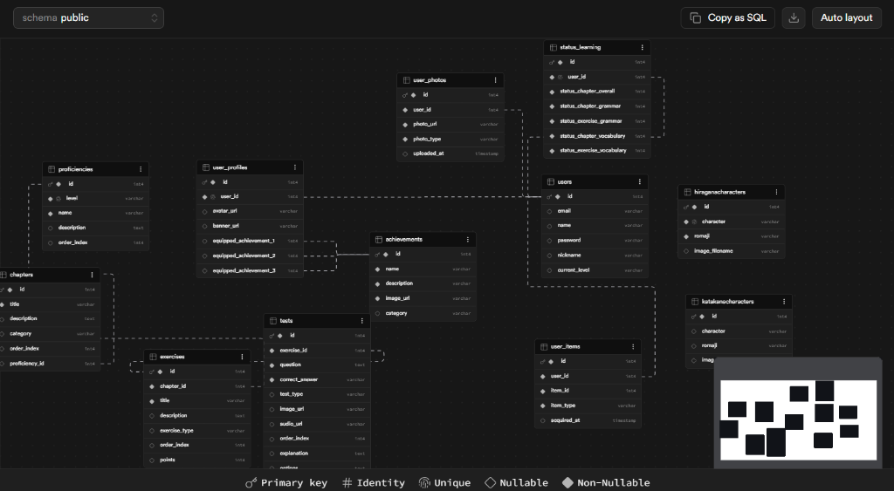
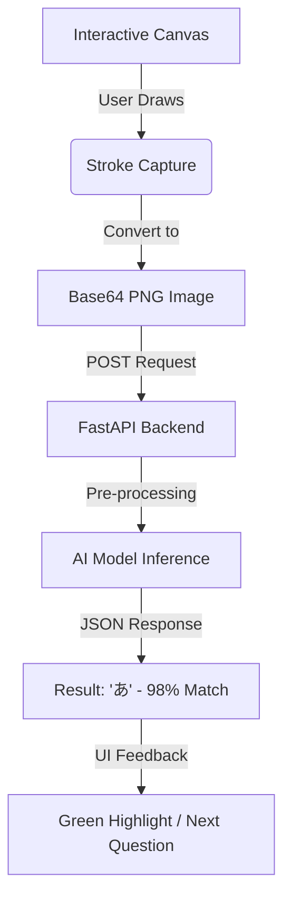

# Tenjin'ya (天神屋) — Innovative Japanese Language Learning

Tenjin'ya is an advanced language learning application primarily designed for learning Japanese, with a high potential to be expanded to more languages. Unlike common platforms, Tenjin'ya provides a comprehensive and immersive path to fluency by focusing on the foundational elements of the language—starting with its unique writing systems—and integrating deep cultural context. We bridge the gap between mechanical memorization and true linguistic comprehension.

---

## 🎨 1. Concept & Philosophy (Project Background)

### 1.1 The Context of Language Learning Apps
The rise of digital learning platforms like **Duolingo**, **HelloTalk**, and **Shinobi** has revolutionized language acquisition. Research (Kukulska-Hulme & Shield, 2008; Deterding et al., 2011) emphasizes that gamification and structured exercises significantly improve user engagement.

However, many of these findings are based on studies like the *Duolingo Effectiveness Study* (Vesselinov & Grego, 2012), which primarily focused on Spanish—a language sharing Latin roots and the same alphabet as English. This represents a significant limitation: the effectiveness of these platforms for Asian languages, which feature fundamentally different writing systems, is often much lower due to the high cognitive overhead required at the start of the learning journey.

### 1.2 The Challenge of Japanese Acquisition
Japanese presents a unique hurdle because it utilizes three distinct writing systems: **Hiragana**, **Katakana**, and **Kanji**. Beginner learners cannot decode even basic signs or menus without first mastering these characters. Most applications skip this foundational stage, using Romaji (Latin transliteration) or forcing character recognition without structured explanation. Tenjin'ya is built on the belief that visual literacy is the prerequisite for all subsequent grammar and vocabulary learning.

### 1.3 Analysis of Existing Platforms: Three Primary Limitations
Through extensively testing multiple platforms and research into current trends, three primary limitations were identified that Tenjin'ya improves upon:

1.  **Absence of Character Mastery**: Characters are often "dropped" into exercises without radical analysis or stroke-order logic, forcing learners to deduce them via pure repetition.
2.  **Toxic Competition vs. Learning**: Many apps use competitive leaderboards and "streaks" that eventually prioritize point accumulation over genuine pedagogical progress.
3.  **Lack of Cultural Context**: Language is inseparable from culture. Essential Japanese concepts like *Keigo* (polite speech) or social hierarchy are often ignored, leading to learners who know words but cannot communicate appropriately in real-world settings.

---

## 📊 2. Comparative Analysis

The table below summarizes the key differences identified across the applications tested, highlighting the specific dimensions in which existing tools fall short and in which Tenjin'ya proposes a more complete solution.

| Feature | Duolingo | Shinobi | HelloTalk | **Tenjin'ya** |
|:---|:---|:---|:---|:---|
| **Grammar** | Decent coverage, but contains significant gaps | No dedicated grammar exercises | No structured grammar learning | **Dedicated grammar section with structured lessons** |
| **Vocabulary** | Basic and repetitive | Strong vocabulary enhancement | Minimal support | **Structured and progressive vocabulary system** |
| **Character Sets** | Very limited (poorly explained) | Minimal focus | Basic introduction | **Full modules for Hiragana, Katakana, and Kanji** |
| **Culture** | None | Very limited (travel only) | Minimal (mostly VIP) | **Dedicated culture module (Traditions, Keigo, Society)** |
| **Engagement** | Highly competitive (Distracting) | Almost no system | Social interaction-based | **Achievement-based motivation (Personal growth)** |

---

## 🚀 3. The Tenjin'ya Solution (Vision & Innovations)

Tenjin'ya introduces components absent from generic platforms to create a more authentic perspectives on the language:

### 3.1 Dedicated Character Learning Module
Users can visualize stroke orders, analyze radicals, and complete recognition exercises. By establishing visual literacy first, learners can read basic word sets early, making it significantly easier to segment sentences and infer vocabulary contextually.

### 3.2 Achievement-Based Motivation
Instead of rankings, Tenjin'ya uses an **individual achievement system**. Users unlock missions and improve skills in different chapters independently. This keeps engagement healthy and focused on personal linguistic goals rather than direct comparison with others.

### 3.3 Interactive Cultural Learning
Our culture module is split into two complementary branches:
-   **Informational Branch**: Geographical/historical landmarks, traditions, and festivals to build an authentic connection with Japanese society.
-   **Social Integration Branch**: Practical guidance on *Keigo* and social etiquette (gestures, registers of formality), ensuring users communicate appropriately in real-world contexts.

---

## 🎯 4. Project Scope: JLPT N5 Alignment

The primary implementation covers **JLPT N5**, the foundational level of the Japanese Language Proficiency Test. This includes all prerequisite vocabulary, grammar particles, and character knowledge required for a beginner. The application is architected for scalability, with future modules planned for N4 through N1.

---

## 🏗️ 5. Technical Architecture

Tenjin'ya aims to bring innovation through a well-crafted aesthetic and modern tech stack.

### **Backend: FastAPI & Uvicorn**
The `main.py` file represents the application's entry point, initializing and configuring the **FastAPI** server. 
- **FastAPI:** A modern, high-performance web framework using Python type hints for automatic validation and interactive API documentation (accessible at `/docs`).
- **ASGI Standard:** FastAPI is based on the Asynchronous Server Gateway Interface, designed to handle multiple requests simultaneously for high efficiency.
- **Uvicorn:** A lightweight, high-performance ASGI server that executes the app on `127.0.0.1:8000`.
- **Static Resources:** Images, audio, icons, textures, and videos are served via the `StaticFiles` module, mounted to specific paths (e.g., `/audio`, `/images`) for accessibility by the frontend.

### **Database Strategy: Supabase & PostgreSQL**
Our core data infrastructure utilizes the **Supabase** platform to host a **PostgreSQL** database. 
- **Postgres Database:** An industry-standard relational system supporting SQL, concurrency control, and diverse data types.
- **Cloud Hosting:** The database runs on Supabase's cloud servers rather than locally, offering superior scalability and API integration.

### **Data Layer: SQLAlchemy ORM**
To interact with the database efficiently, we use **SQLAlchemy**, a Python Object-Relational Mapping (ORM) library. This acts as an abstraction layer:
- **Python Classes:** Database tables are defined as Python classes mapping directly to the DB.
- **Readability & Security:** It improves maintainability and prevents SQL injection by translating Python expressions into SQL commands.
- **`database.py` Breakdown:**
  - `Sessionmaker`: Creates new sessions for requests.
  - `get_db()`: Manages session lifecycle for each request.
  - `create_engine`: Uses the Supabase URL to connect to the database.
  - `declarative_base()`: Maps Python classes to PostgreSQL tables.

---

## 📂 6. Modular Innovation: Vocabulary vs. Grammar

Most apps pick basic words and cycle them to teach grammar. Without auxiliary book support, users lack the choice to learn conversational vocabulary.
**Tenjin'ya's Solution:** We separated the logic into two distinct modules:
1. **Grammar Module:** Focuses on particles, verb endings, and sentence structure.
2. **Vocabulary Module:** Allows users to learn words (colors, transport, numbers) outside the grammar scope.
Users can focus on a specific component they wish to consolidate without being required to follow the entire application flow each time.

---


Tenjin-ya prioritises a premium, aesthetic experience from the moment the user enters the application:

1.  **Authentication & Entry**: Users are first met with a sleek login interface. This stage ensures that each student's progress in characters, grammar, and vocabulary is individually tracked and securely stored.
2.  **The Welcome Selection**: Once logged in, the user is transitioned into the immersive "Selection Screen." This is governed by a dynamic **Pink Ribbon Menu** (animated with custom CSS for a premium feel).
3.  **Picking a Path**: From the main menu, users can pick their current focus:
    *   **Grammar**: Master syntax and particles (JLPT N5 focus).
    *   **Vocabulary**: Explore cardinal numbers, colors, and travel-specific terms.
    *   **Culture**: Enter the "Scroll of Knowledge" to read PDFs about Japanese traditions like the Tea Ceremony or Samurai history.
    *   **Profile**: Customise avatars, view achievements, and check overall learning status.


---

## 🗄️ 7. Database & Exercise System

### **Database Structuring (March 2025)**


The database has been restructured for better scalability and separation of concerns.

**New Schema Hierarchy:**
```
Proficiency (N5, N4, N3, N2, N1)
  └── Chapter (grammar / vocabulary / culture)
        └── Exercise (quiz, course, examination, interactive)
              └── Test (multiple_choice, sentence_builder, matching, text_input, fill_blank, true_false)
```

**Tables Overview:**

| Table | Purpose |
|-------|---------|
| `users` | Core account: email, name, password, nickname, current_level |
| `user_profiles` | Avatar URL, banner URL, 3 equipped achievement slots |
| `user_photos` | Tracks uploaded photos (type: avatar/banner/gallery) |
| `user_items` | Inventory of owned items (achievements, banners) |
| `status_learning` | Per-module progress (grammar chapter/exercise, vocabulary chapter/exercise) |
| `proficiencies` | JLPT levels: N5 (Beginner) → N1 (Advanced) |
| `chapters` | Grouped under proficiency, categorised as grammar/vocabulary/culture |
| `exercises` | Inside chapters, with exercise_type and XP points |
| `tests` | Individual questions with flexible JSON options, test_type determines UI |
| `achievements` | Collectible items with name, description, image |

### **Exercise System Architecture**
The exercise runner supports interactive question types for grammar exercises. Each `Test` row has a `test_type` that tells the frontend which renderer to use, and an `options` JSON column with type-specific data.

**Supported Test Types:**
-   `multiple_choice`: Standard pick-one selection.
-   `sentence_builder`: Drag-and-drop word blocks for syntax practice.
-   `matching`: Pair-based recognition (Japanese ↔ English).
-   `text_input`: Free typing (integrated with **Wanakana** for kana input).
-   `fill_blank` & `true_false`: Foundational logic checks.

**Implementation File Structure:**
```
features/exercises/
├── routes.py              — /exercise/{id} unified endpoint
├── renderer.py            — one render function per test_type
└── templates/
    └── exercise_runner.py — lesson page with progress bar and results
```

---

## 🎮 8. Getting Started

### **Startup**
The database schema is initialized automatically via `Base.metadata.create_all(bind=engine)`, creating tables if they do not exist.
To run the server locally:
```bash
python main.py
```
Access the application at `http://127.0.0.1:8000`.

---

## 📚 9. References & Research

-   **Kukulska-Hulme, A., & Shield, L. (2008).** *An overview of mobile assisted language learning.* ReCALL Journal.
-   **Deterding, S., Dixon, D., Khaled, R., & Nacke, L. (2011).** *From Game Design Elements to Gamefulness: Defining “Gamification”.*
-   **Vesselinov, R., & Grego, J. (2012).** *Duolingo Effectiveness Study.*


*“Evolution and justification through confidence and a well-crafted aesthetic: Tenjin'ya helps people achieve the results they wanted by solving the problems inherent in outdated platforms.”*

---

---

## 🌸 APRIL 2026 UPDATE: Roadmap & Goals

This month, the development focus shifts from core architecture to content expansion and interactive AI features.

### **1. Mastering the Kana (Hiragana & Katakana)**
- **Data Completion**: Completely fill the Hiragana and Katakana master tables. This includes matching every character with its correct stroke-order video, native audio pronunciation, and mnemonic images.
- **Progress Tracking**: Ensure every character cell in the grid correctly tracks the "hover-to-fill" heart animation for user engagement.

### **2. Kanji Foundation**
- **Table Structure**: Create the architecture for the Kanji module.
- **Content Strategy**: Define what each Kanji entry should contain: Onyomi/Kunyomi readings, radical breakdown, and JLPT N5 specific vocabulary usage.

### **3. AI Handwriting Recognition System**
The most innovative feature for April is the implementation of a real-time handwriting "writing border" and recognition pipeline.

**The Workflow Sketch:**


**Implementation Details:**
- **Border Logic**: Implement a responsive canvas border that correctly detects stroke boundaries.
- **Conversion**: Use `canvas.toDataURL()` to transform drawings into data blobs.
- **AI Integration**: Design the backend to receive these blobs and pass them to either a pre-trained CNN (Convolutional Neural Network) or a lightweight recognition API to validate the user's writing correctly.

### **Update 2nd April: Working AI Integration**
We successfully implemented the AI Handwriting Validation pipeline!
- **Integration Point**: The `/writing-exercise` canvas uses a Javascript bounding-box algorithm (`getCroppedCanvas`) to crop only the drawn pixels, optimizing the payload.
- **Transport Mechanism**: Drawings are sent as base64-encoded PNG blobs over a JSON POST request to a new `/api/verify-writing` backend endpoint.
- **AI Backend**: The backend is connected to the **Google Cloud Vision API**. It uses the `document_text_detection` algorithm with Japanese `language_hints=["ja"]`, which is highly effective for recognizing handwriting.
- **Interaction Flow**: The canvas system now dynamically requests characters. The user draws, clicks "Recognize", and the Cloud Vision AI validates whether their handwriting matches the expected Kana or Kanji, providing instant color-coded feedback!
- **Authentication Setup**: The Cloud Vision integration is fully securely authenticated via a service account key `google-credentials.json` kept at the project root, which is dynamically loaded as an environment variable when `main.py` boots up.

---

## 📅 MAY 2026 UPDATE: Expansion & Robustness

Building upon the foundations of April, May focuses on content volume, offline accessibility, and polishing the user profile ecosystem.

### **1. Writing System Completion**
- **The Three Pillars**: Finalize all interactive features for the **Hiragana, Katakana, and Kanji** tables. This includes full stroke-order support, mnemonic triggers, and comprehensive recognition testing for every character set.

### **2. Hybrid Connectivity: Offline & Online Modes**
- **Persistent Learning**: Implement a robust **Offline Mode** utilizing local storage/caching, allowing users to continue their lessons without an active internet connection.
- **Seamless Sync**: Develop an automated synchronization pipeline that pushes local progress to the Supabase cloud once connectivity is restored.

### **3. Content Deep-Dive**
- **Culture Expansion**: Author and integrate **5 new chapters** into the Culture module, expanding the "Scroll of Knowledge" with deep-dives into modern society and historical nuances.
- **Core Curriculum**: Deploy a significant content patch adding **5 comprehensive exercises** to both the Grammar and Vocabulary modules (JLPT N5 focus), bringing more variety to daily study sessions.

### **4. Profile & UI Polishing**
- **Bug Squashing**: Conduct a full audit of the **User Profile** system. Resolve all reported issues regarding avatar synchronization, achievement display, and status tracking to ensure a seamless "Premium" feel across the dashboard.
- **Aesthetic Refinement**: Continue fine-tuning micro-animations and transition states to maintain Tenjin'ya's high-end visual identity.

---

## 🎓 JUNE 2026 UPDATE: Bachelor Thesis Finalisation

The final milestone for the summer focuses on content completion and platform-agnostic stability for the **Bachelor Thesis Presentation**.

### **1. The Scroll of Knowledge: Complete Content**
- **Cultural Storytelling**: Reach the milestone of **10 Cultural Stories**, fully illustrated and integrated with PDF reading materials.
- **Advanced Curriculum**: Populate **2 full chapters** each for Vocabulary and Grammar, ensuring they are packed with diverse interactive exercises to demonstrate the system's scalability.
- **Rewarding Mastery**: Implement specific **Achievements** tied to completing Culture stories and reading modules, rewarding curiosity and deep-learning.

### **2. Innovative Kanji Puzzle Mechanic**
- **Decomposition & Synthesis**: Introduce a unique **Kanji Puzzle System**. Users first learn to write foundational basic Kanji (radicals) and then interactively "snap" them together in a puzzle-like UI to form complex characters, reinforcing the logic of the writing system.

### **3. Distribution & Independent Verification (Optional)**
- **Portable Tenjin'ya**: Research and develop an **executable (.exe)** version of the application using PyInstaller or similar, allowing for local installation without a Python environment.
- **Universal Flow**: Ensure that account creation, level progression, and profile management remain entirely independent and stable within the installed application, ready for a flawless live demonstration.

---

*“Evolution and justification through confidence and a well-crafted aesthetic: Tenjin'ya helps people achieve the results they wanted by solving the problems inherent in outdated platforms.”*
